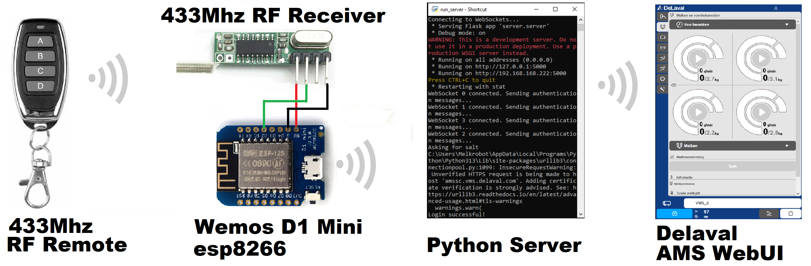

# Delaval V300 AMS automatic webui authentication and 433MHz remote control

## Overview

A Python program that automates login and WebSocket communication with Delaval V300 AMS machines using hashed credentials, enabling control of multiple units.

Example code for a 433MHz remote control for the Delaval Milking Robot was added for an esp8266 with a generic 433MHz receiver, requesting server urls.

Example code for a Diverted Milk Logger is also included.

## Installation

1. **Clone the repository:**
   ```sh
   git clone https://github.com/Dokterfrits/Delaval_V300_Websocket_API
   cd Delaval_V300_Websocket_API

   ```
2. **Create a virtual environment (optional but recommended):**
   ```sh
   python -m venv venv
   source venv/bin/activate  # On Windows: venv\Scripts\activate
   ```
3. **Install dependencies:**
   ```sh
   pip install -r requirements.txt
   ```
4. **Configuration:**

   Rename **config_template.json** to **config.json** and update the credentials and urls:
   ```json
   {
       "username": "your_username",
       "password": "your_password",
       "urls": [
          "wss://192.168.168.1/ws", // Your AMS on network. Variations on "wss://vms_1.vms.delaval.com/ws" might also work
          "wss://192.168.168.2/ws" // Second machine, add more lines if necessary
       ]
   }
   ```
5. **Run Server:**
   ```sh
   python run_server.py
   ```
   
## Usage
The Flask server exposes a URL endpoint that accepts mode change requests with machine- and mode indices.
**Example URL:**

    localhost:5000/mode/10


Where:
- `1`: The machine index (machine 1 in this case).
- `0`: The mode index (0 refers to the first mode, e.g., "auto").

### Mode Options

The available modes are:
1. `"auto"`
2. `"manual"`
3. `"activatedelayedrel"`
4. `"activatemanualclosedstall"`

### Example Request

To change the mode of machine 2 to "manual", you would call:

    localhost:5000/mode/21
    
To request the mode of all machines, you would call:

    localhost:5000/state
    
These requests can be made by an esp8266 like the Wemos D1 Mini. Example code is available to trigger these requests using a 433Mhz remote.



This is extremely useful when fetching cows, as it enables remote controlled gate opening.
## Features

- Secure authentication with hashed credentials
- WebSocket connection to multiple machines
- 433MHz remote control implementation using esp8266 and generic receiver module
- Sends control messages dynamically to a selected machine

## Troubleshooting

- If authentication fails, check the credentials in `config.json`.
- If SSL errors occur, try setting `verify=False` in requests.
- If no messages are received, ensure WebSocket URLs are correct.

## License

MIT License

## Example of data send by the AMS 

```json
{"ms":
  {"stall":
    {"orientation":"right",
    "entryGate":"closed",
    "exitGate":"closed",
    "entryGateOpenable":true,
    "exitGateOpenable":true,
    "rearPlate":"active",
    "mangerPosition":"pos_2",
    "cow":"detected",
    "floorCleaner":"inactive",
    "hoofCleaner":"inactive",
    "endeffectorCleaner":"inactive",
    "delayedRelease":"inactive",
    "trappedCow":{"startTime":0,"stopTime":0,"state":"inactive"},
    "closedStall":"inactive",
    "manualClosedStall":"inactive",
    "cowPusher":"inactive",
    "cowPusherEnabled":false,
    "floorCleanerEnabled":false,
    "hoofCleanerEnabled":false,
    "endEffectorCleanerEnabled":false,
    "delayedReleaseEnabled":true,
    "hoofCleanerActivated":true},
  "separationGate":
    {"direction":"left",
    "mode":"manual",
    "type":"twoway",
    "enabled":true},
  "milkDest":
    {"destination":"tank",
    "decision":"system",
    "severalDivertCows":false,
    "divertInstalled":true,
    "pumpState":"do",
    "purgeState":"dont",
    "pumpBtnEnabled":false,
    "purgeBtnEnabled":false,
    "milkValvesInWrongPosition":false},
  "cow":
    {"cowId":27,
    "transponderId":448,
    "milkingPermission":"granted",
    "feedOnly":false,
    "passThrough":false,
    "udder":
        {"teats":[
            {"pos":"LF",
            "expectedYield":1658,
            "flow":0,
            "yield":90,
            "cleaningStatus":"done",
            "attachingStatus":"done",
            "milkingStatus":"dooing",
            "incomplete":false},
            {"pos":"RF",
            "expectedYield":1875,
            "flow":0,
            "yield":0,
            "cleaningStatus":"done",
            "attachingStatus":"do",
            "milkingStatus":"do",
            "incomplete":false},
            {"pos":"LR",
            "expectedYield":2356,
            "flow":780,
            "yield":270,
            "cleaningStatus":"done",
            "attachingStatus":"done",
            "milkingStatus":"dooing",
            "incomplete":false},
            {"pos":"RR",
            "expectedYield":2361,
            "flow":480,
            "yield":140,
            "cleaningStatus":"done",
            "attachingStatus":"done",
            "milkingStatus":"dooing",
            "incomplete":false}]}},
  "lastCow":
    {"cowId":85,
        "transponderId":1125,
        "milkingPermission":"denied",
        "feedOnly":false,
        "passThrough":true,
        "udder":
            {"teats":[
            {"pos":"LF",
            "expectedYield":1136,
            "flow":0,
            "yield":0,
            "cleaningStatus":"done",
            "attachingStatus":"done",
            "milkingStatus":"done",
            "incomplete":false},
            {"pos":"RF",
            "expectedYield":1295,
            "flow":0,
            "yield":0,
            "cleaningStatus":"done",
            "attachingStatus":"done",
            "milkingStatus":"done",
            "incomplete":false},
            {"pos":"LR",
            "expectedYield":1669,
            "flow":0,
            "yield":0,
            "cleaningStatus":"done",
            "attachingStatus":"done",
            "milkingStatus":"done",
            "incomplete":false},
            {"pos":"RR",
            "expectedYield":1647,
            "flow":0,
            "yield":0,
            "cleaningStatus":"done",
            "attachingStatus":"done",
            "milkingStatus":"done",
            "incomplete":false}]}},
"tank":
  {"acceptMilk":true,
  "filterButtonActive":false},
"clean":
    {"waterTemp":200,
    "fillWaterTemp":337,
    "lastCleaning":1745209462675,
    "lastRinse":1745218327985,
    "cleaningEnabled":false,
    "stopCleaningEnabled":false,
    "cleaningQuestion":
        {"cleaningRequested":false,
        "recommendedCleaningProg":0,
        "allowLater":false,
        "drainButtonEnabled":false},
 ...
"prepareMilking":
    {"acceptCow":"done",
    "identifyCow":"done",
    "autoClean":"done",
    "preDisinfect":"dont",
    "autoAttach":"dooing",
    "holdMilkTubes":"do",
    "postDisinfect":"do",
    "backFlush":"do",
    "releaseCow":"do",
    "acceptCowEnabled":false,
    "identifyCowEnabled":false,
    "autoCleanEnabled":false,
    "preDisinfectEnabled":false,
    "autoAttachEnabled":false,
    "holdMilkTubesEnabled":false,
    "postDisinfectEnabled":false,
    "backFlushEnabled":false,
    "releaseCowEnabled":false,
    "autoAttachLeftFrontEnabled":false,
    "autoAttachRightFrontEnabled":false,
    "autoAttachLeftRearEnabled":false,
    "autoAttachRightRearEnabled":false},
...
```


